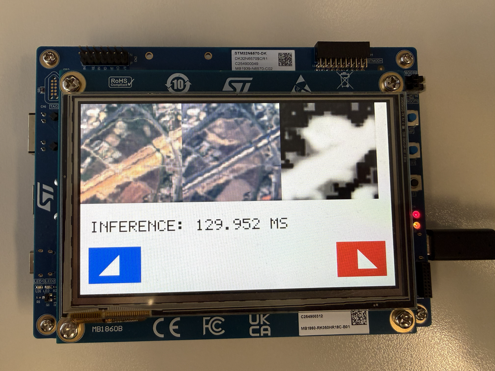
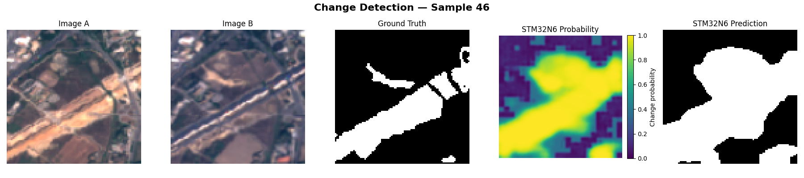

# BTC Change detection on STM32N6

[Be The Change](https://github.com/blaz-r/BTC-change-detection) training, ONNX export, host validation, and an LCD/touchscreen demo for the
STM32N6570-DK. The model processes a pair of RGB images and predicts change. 
The detection performance stays almost unchanged.

This is not a plug and play project, mostly collection of code and notes I wrote
while trying to get the BTC to work on STM32N6. A lot of the code here was also written by codex (given my limited time) so it's not the cleanest.
If there's sufficient interest, I'll try to polish it up and make it more user-friendly.

| Directory | Contents                                                                        |
| --- |---------------------------------------------------------------------------------|
| [training](training/README.md) | Training code, model implementations, configs, ONNX export and evaluation |
| [host](host/README.md) | Serial validation with `stm_ai_runner`, model inspection, C image generation    |
| [firmware](firmware/README.md) | Cube configuration, IDE settings, application/FSBL sources and linker scripts   |
| [docs/load_tricks.md](docs/load_tricks.md) | Loading, signing, flashing, LCD/touchscreen setup and cache notes               |

Start with training/export, quantize the ONNX model with ST's tools, and then
choose either host-driven validation firmware or the standalone LCD demo.

The base and quantized `test-unet-tr` ONNX models and the Cube-generated network
bundle (including weights) are included through Git LFS. See
[model files and LFS setup](docs/MODELS.md) after cloning.
Datasets (except two examples), training checkpoints, Cube SDK libraries and build outputs are not
included. See the firmware guide before importing/building the Cube projects.
The original workspace used CubeMX 6.17.0, STM32Cube FW_N6 V1.3.0, CubeIDE 2.2.0
and ST Edge AI 4.0.

One recorded run took 32 ms as per ST Edge web app, with int8 input `[1, 6, 96, 96]` and int8 output
`[1, 1, 96, 96]`. On device it's in range of 120ms. Check shapes and quantization in the host and firmware code
if you change the model.

I did some preliminary experimenting to get ViT working, but didn't get it to work. 
There is a nice repo online that does that here: https://github.com/minchoCoin/stm32n6-transformer but this is basic ViT
and I'd want to get DINOv3 vit working. Maybe one day...
